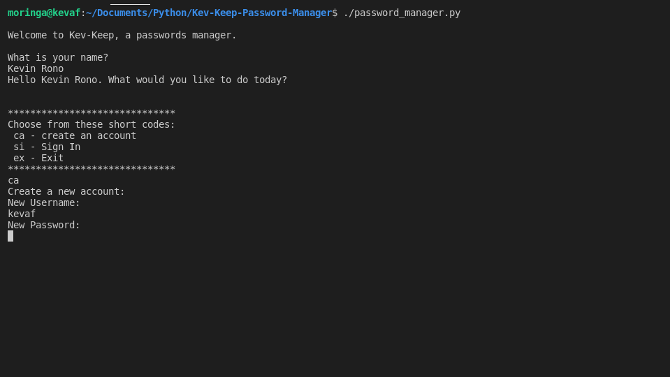

# Kev-Keep-Password-Manager

A Comand Line Interface that allows users to create an account and manage their passwords in it.

## Description.
This is a CLI project that allows a user to manage their passwords by creating an account with Kev-Keep-Password-Manager and then storing their users in the account by categorizing them by the Account name.

## Author & Contact Information.
This web app was created by Kevin Kipyegon. If you have any suggestions or improvements you can reach the author via mail at kevin.kipyegon@student.moringaschool.com

## Istallation.
1. Must have Python 3.6
2. git clone  https://github.com/kevaf/Kev-Keep_Password-Manager.git to your local machine storage.
3. cd to Kev-Keep_Password-Manager
4. Open with a text editor of your choice.(Recommended VS Code)
5. Run $ chmod +x password_manager.py
6. Run ./password_manager.py

## ScreenShot.

## Liscence.
This is an open source project avaiable under the [MIT Liscence](LISCENCE).

